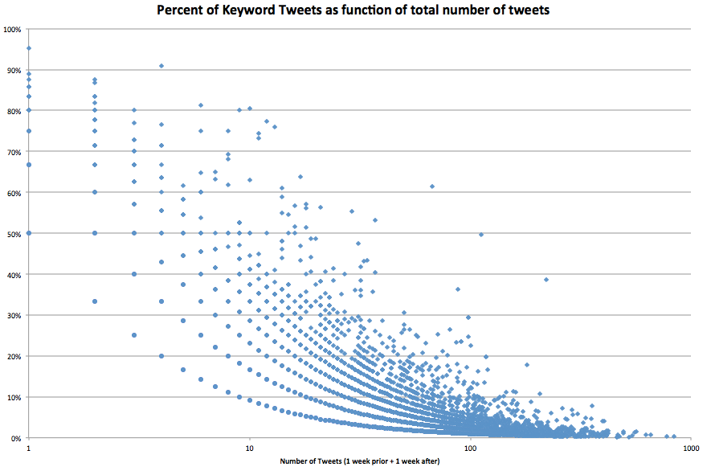
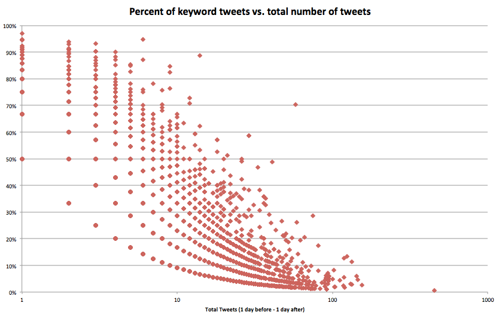

Note: In this particular analysis, 'contextual' is only contextual stream tweets which have a geo-tag.

##Part I: Geo Analysis without contextual information

Given the x-axis is a log scale, it falls off very, very quickly; in general, people who tweeted about the storm did so infrequently with regards to keywords.

Taking a closer look, here is the activity for October 28 - October 30, a very small window where we know users were the most active:

Interestingly, this is a very different distribution, much, much higher, while we're still missing a lot of data without the contextual stream, it's surprisingly not as bad as expected. Remember, however, this is just geo-taggged tweets in the contextual stream.  **In sum: _people tweet on-topic_**

> Future Work: We can regenerate this with all contextual stream tweets (not just geo-tagged), and show what a truly small amount of tweets for an active period (such as the day of landfall) are actually collected via normal keyword searches.

##Part II: New Clustering
Adding much, much more data to the mix -- Tweets now going back 2 years, if available.

###Relative Distance Calculation
Given a 'home' location, create a movement profile which looks at a user's activity each day. Which clusters do they move between? It will be sparse, but perhaps this is okay.

